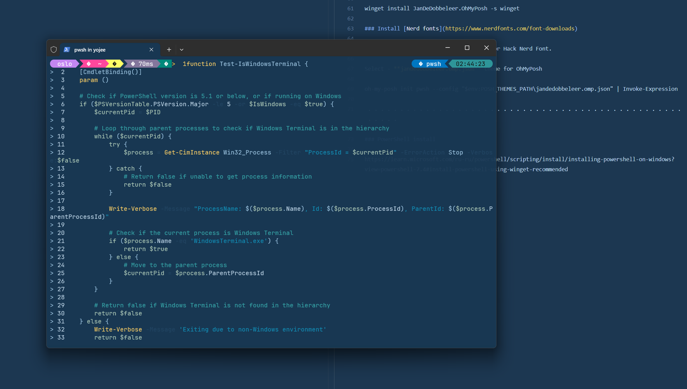

#### Install Lagoon theme in Windows Terminal

Install Fonts from folder.   
Run Windows Terminal.   
Select Settings - open and edit the "settings.json".   
Copy all from local settings.json and insert in setting.json.   
Save the file and restart Windows Terminal.   

#### OhMyPosh install in Windows Terminal

winget install --id Microsoft.PowerShell --source winget

```   
Configure Your Terminal to Use the Nerd Font.
Navigate to Settings > PowerShell > Appearance > Text > Font Face.
```

winget install JanDeDobbeleer.OhMyPosh -s winget

New-Item -Path $profile -Type File -Force  

oh-my-posh --init --shell pwsh --config ~/jandedobbeleer.omp.json | Invoke-Expression 

notepad.exe $PROFILE   

oh-my-posh.exe init pwsh | Invoke-Expression   
