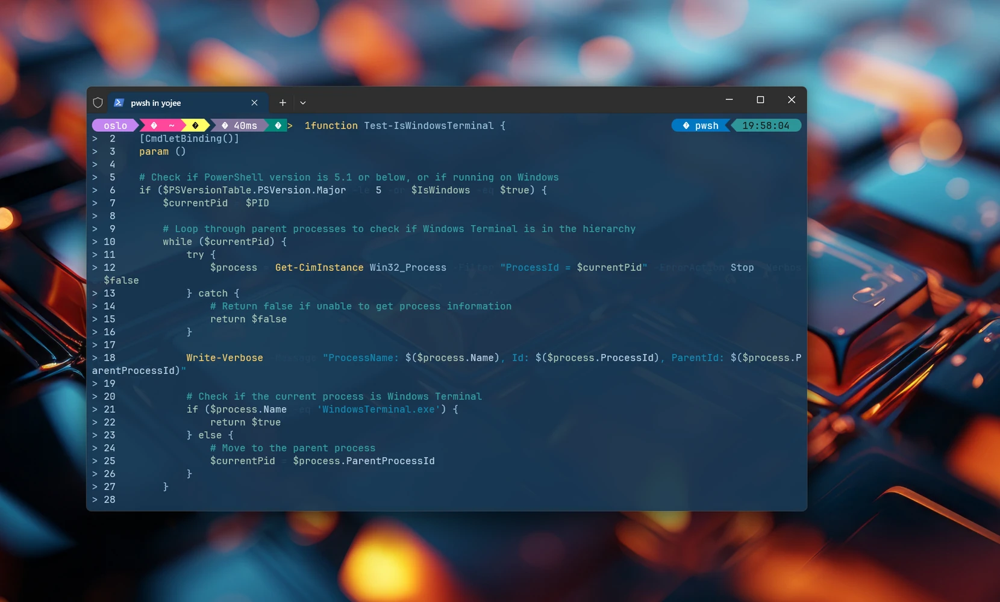
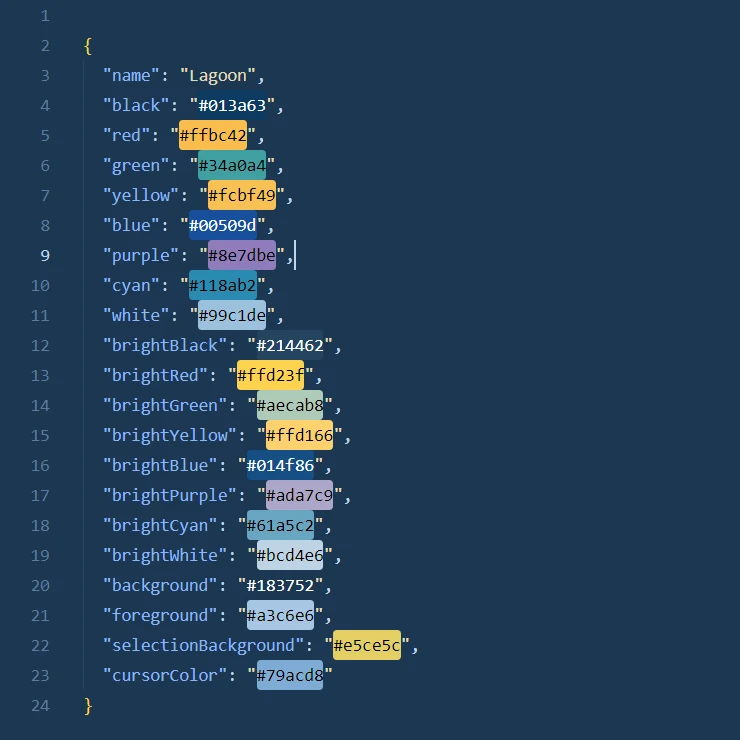

## Install Lagoon theme in Windows Terminal.

- Run Windows Terminal

- Select Settings from the Windows Terminal drop-down menu while holding the SHIFT key to open the "settings.json" file in your default text editor.

- Edit > settings.json.

- Copy all and insert in setting.json between the lines like this:  

```json

"schemes": 
    [
        {
            "name": "Lagoon",
            "black": "#013a63",
            "red": "#ffbc42",
            "green": "#34a0a4",
            "yellow": "#fcbf49",
            "blue": "#00509d",
            "purple": "#8e7dbe",
            "cyan": "#118ab2",
            "white": "#99c1de",
            "brightBlack": "#214462",
            "brightRed": "#ffd23f",
            "brightGreen": "#aecab8",
            "brightYellow": "#ffd166",
            "brightBlue": "#014f86",
            "brightPurple": "#ada7c9",
            "brightCyan": "#61a5c2",
            "brightWhite": "#bcd4e6",
            "background": "#183752",
            "foreground": "#a3c6e6",
            "selectionBackground": "#e5ce5c",
            "cursorColor": "#79acd8"
            }
    ],

```

- Save

- Open Settings in Windows Terminal and select Lagoon theme by default theme.

Enjoy !

```
In setting.json you can change some parametres like transparent.
```

### Lagoon theme Palette



> Theme based by MonoLisa Font for Coders [website](https://www.monolisa.dev/).

------------------------------------------------

# OhMyPosh install in Windows Terminal

winget install JanDeDobbeleer.OhMyPosh -s winget

### Install [Nerd fonts](https://www.nerdfonts.com/font-downloads)  

My favorites - JetBrains Mono Nerd Font or Hack Nerd Font.

### Select **jandedobbeleer.omp.json** theme for OhMyPosh

oh-my-posh init pwsh --config "$env:POSH_THEMES_PATH\jandedobbeleer.omp.json" | Invoke-Expression

# PowerShell install

https://learn.microsoft.com/ru-ru/powershell/scripting/install/installing-powershell-on-windows?view=powershell-7.4#install-powershell-using-winget-recommended

 . . . . . . . . . . . . . . . . . . . . . . . . . . . . . . . . . . . . . . . . . . . . . . . . . . . . . .

```
Download [Wallpapes](https://github.com/yojeero/wallpapers).

```

```
Look at VSCode theme [Motion Blue](https://marketplace.visualstudio.com/items?itemName=5ett.motion-blue).

```